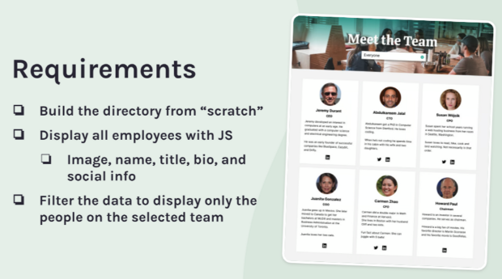
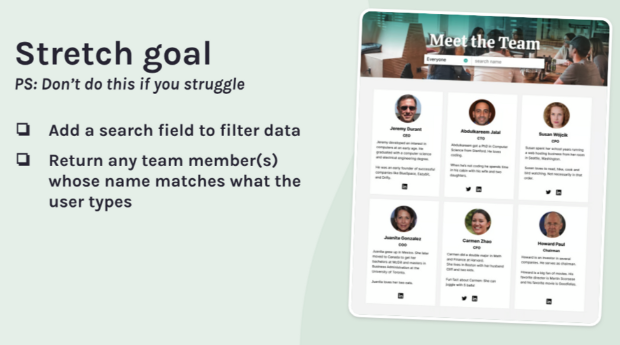

## Employee Directory

### The challenge:

This is a Scrimba solo project using HTML, CSS and JavaScript to create an Employee Directory.

### The requirements:



### Stretch goals:



### Screenshot:


### Process

- Consult Figma design files
- Create draft of README file
- Create .gitignore file and check that meta tag is included
- Create Github repository
- Work on HTML, CSS and JS files
- Check final code and accessibility
- Finalize README file
- Publish live URL

### Questions

- Hero image: Is there a better way to display the hero image in general/responsively?

- For the employee cards...how to display left and right margins in the browser. Solution: Added left and right margin to the class: employee-container

```
.employee-container {
  display: grid;
  grid-template-columns: repeat(auto-fit, minmax(250px, 1fr));
  justify-content: center;
  gap: 20px;
  margin: 0 20px;
  padding-top: 20px;
}
```

- Better way to display the select input field and/or make it more accessible?

### Challenges

- When mapping over the employees data, only the second image displayed. Solution: The employee file should only display the following code for image:

```
image: "jansen.jpg",
```

...and not the entire path.

- Had to learn to use "change" (not "click") in order to target the selected option in the dropdown menu:

```
selectMenu.addEventListener("change", filterEmployeesByTeam);
```

### Improvements/Enhancements to Consider

- Make it a React project
- Complete the stretch goals

### Useful Code Snippets

Responsive design with grid:

```
  display: grid;

  grid-template-columns: repeat(auto-fit, minmax(280px, 1fr));
```

Accessibility:

- Add `select: focus` to the select menu

```css
select:hover,
select:focus {
  background-color: #5e716a;
  color: #fff;
  border: 2px solid #fff;
}
```

- Add helper class `visually-hidden` to the label of the select menu. That way it is hidden to the user, yet accessible.

```html
<label for="select" class="visually-hidden">Search for members by team</label>
```

```css
.visually-hidden {
  position: absolute;
  clip: rect(0 0 0 0);
  height: 1px;
  width: 1px;
  margin: -1px;
  padding: 0;
  border: 0;
  overflow: hidden;
}
```

Refactor code with html helper function:

- Create an html function to refactor code and make code DRYer

```html
function generateEmployeeHtml(emp) { return `
<div class="card">
  
  <h2>${emp.name}</h2>
  <h3>${emp.title}</h3>
  <p>${emp.bio}</p>
</div>
`; }
```

That way I can use this html function two places instead of repeating the html code twice.

Here:

```jsx
function renderEmployees() {
  const employeeList = employees.map(generateEmployeeHtml).join("");
  employeeContainer.innerHTML = employeeList;
}
renderEmployees();
```

And here:

```jsx
//Render function to filter the employees by team
function filteredEmployeesByTeam() {
  // returns an array of employee objects that match the condition
  const filteredTeams = employees.filter(function (emp) {
    if (select.value.toLowerCase().includes(emp.team)) {
      return emp;
    }
  });

  const filteredEmployeeList = filteredTeams.map(generateEmployeeHtml).join("");

  employeeContainer.innerHTML = filteredEmployeeList;

  //Render everyone if "everyone" or "select-team" options are selected
  const checkedValue = document.querySelector("option:checked").value;

  if (checkedValue === "everyone" || checkedValue === "select-team") {
    renderEmployees();
  }
}
```

Make the employee cards appear more visually appealing with `justify-content: flex-start`. The cards are then the same size and the text blocks align with each other:

```css
.card {
  display: flex;
  flex-direction: column;
  gap: 18px;
  /* justify-content: space-around; */

  justify-content: flex-start; /* flex-start aligns the cards more succinctly */
  background-color: #fff;
  margin: 0 auto;
  padding: 1em 1.5em;
  border: 1px solid #eaeaea;
  border-radius: 0.3em;
}
```

Displaying social icons:

```jsx
function generateEmployeeHtml(emp) {
  // create html for social icons
  let socialHtml = "";

  if (emp.social.linkedin && emp.social.twitter) {
    socialHtml = `
      
      `;
  } else if (emp.social.linkedin) {
    socialHtml = ``;
  } else {
    socialHtml = ``;
  }

  // create html for the card
  return `
  <div class="card" >
    
    <h2>${emp.name}</h2>
    <h3>${emp.title}</h3>
    <p>${emp.bio}</p> 
    <div class="social-container">${socialHtml}</div>    
  </div>`;
}
```

… and making the icon stick to the bottom of the card with\*\* `margin-top: auto;`

```css
.social-container {
  margin-top: auto;
}
```

### Resources used:

- [YouTube about filtering employees in Employee Directory](https://www.youtube.com/watch?v=8Y8963ScwPY)

- [Display JS array](https://stackoverflow.com/questions/58572752/how-to-display-this-js-array-in-a-html-list)

- [Creating a custom select menu](https://www.w3schools.com/howto/howto_custom_select.asp)

- [The Select Menu Element](https://css-tricks.com/the-selectmenu-element/)

- [Mapping array data to a web page with Vanilla JS](https://seven.hashnode.dev/mapping-with-vanillajs)

- [Kevin Powell's Custom Select Menu](https://www.youtube.com/watch?v=bB14uo0Tu5A)

- [CSS-TRICKS In-page Filtered Search with Vanilla JavaScript](https://css-tricks.com/in-page-filtered-search-with-vanilla-javascript/)

- [How to filter an array in array of objects in Javascript?](https://stackoverflow.com/questions/69091869/how-to-filter-an-array-in-array-of-objects-in-javascript)

- [Filter array of objects whose any properties contains a value](https://stackoverflow.com/questions/44312924/filter-array-of-objects-whose-any-properties-contains-a-value)

- [How to filter elements](https://www.w3schools.com/howto/howto_js_filter_elements.asp)

- [Simple Filters in CSS or JS](https://dev.to/dhintz89/simple-filters-in-css-or-js-185k)

- [How to Output JSON data into the web page JavaScript code and JSON data for web page content](https://www.youtube.com/watch?v=LkvdPf6LCeM)
