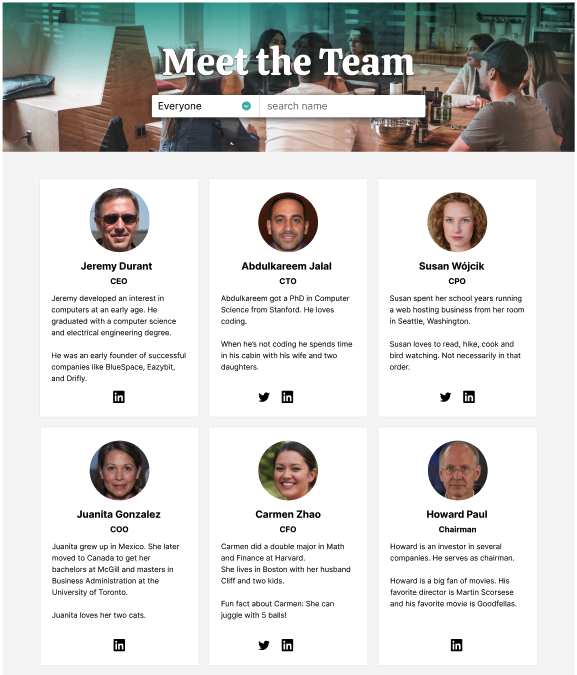

## Employee Directory

### The challenge:

This is a Scrimba solo project using HTML, CSS and JavaScript to create an Employee Directory.

### The requirements:

### Stretch goals:

### Screenshot:

- Consult Figma design files
- Create draft of README file
- Create .gitignore file and check that meta tag is included
- Create Github repository
- Work on HTML, CSS and JS files
- Check final code and accessibility
- Finalize README file
- Publish live URL

### Challenges and goals to improve in the future:

- pending...

### Resources used:

- pending...
